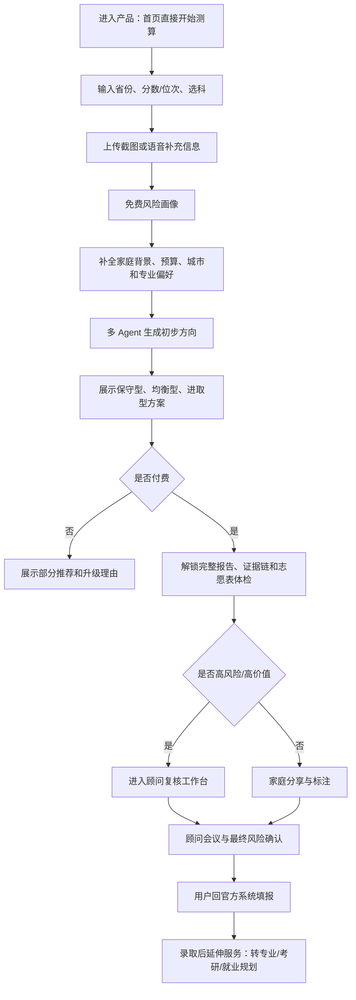
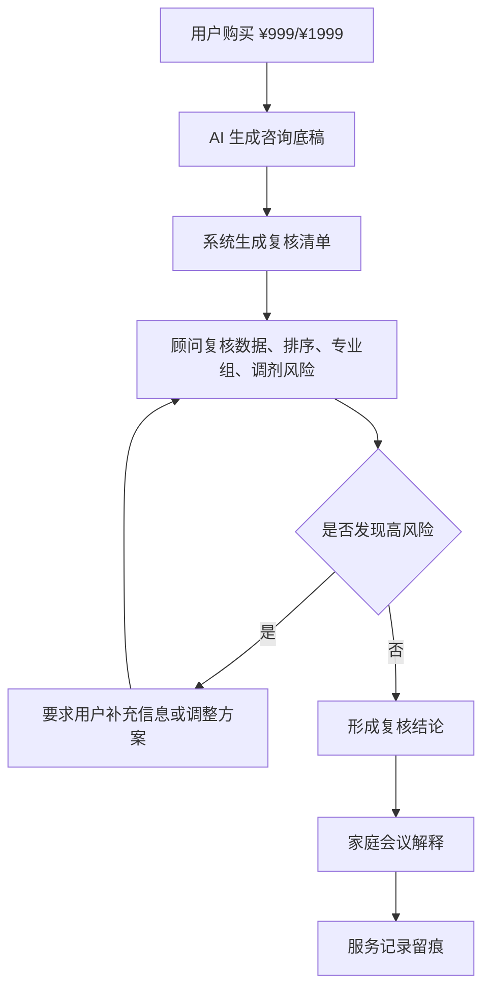
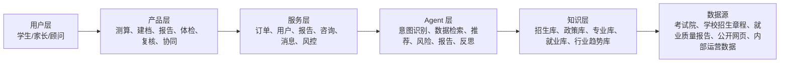
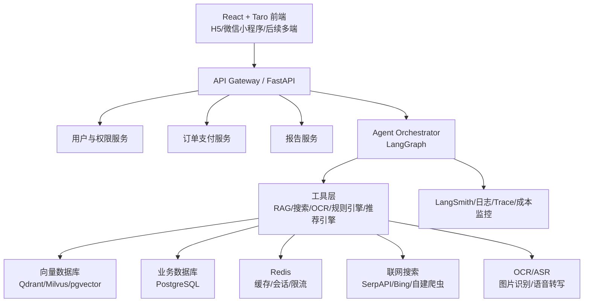
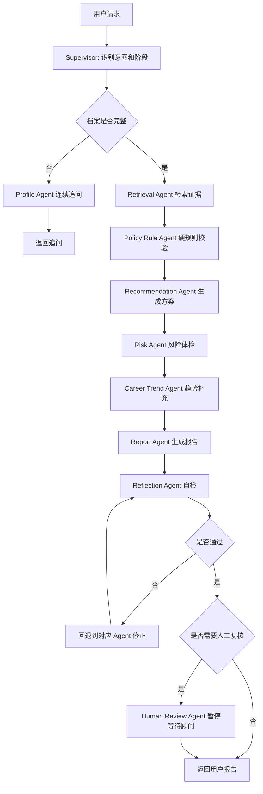
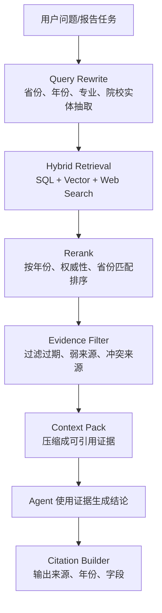

# 志愿规划 Agent 业务导向 + 技术导向 PRD

版本：v0.2  
日期：2026-05-30  
产品形态：React + Taro 多端应用，首期 H5/小程序兼容  
后端框架：FastAPI + LangChain + LangGraph  
核心能力：RAG、向量数据库、Memory、联网搜索、外部工具调用、多 Agent 协同、专家复核

---

## 1. 产品定位

### 1.1 一句话定位

志愿规划 Agent 是面向高考生和家长的 **AI 志愿决策助理 + 专家复核咨询平台**，通过多模态建档、招生数据 RAG、冲稳保推荐、志愿表风险体检、多 Agent 分析和顾问复核，帮助家庭在短时间内形成可解释、可追溯、可复核的志愿填报方案。

### 1.2 核心差异

不是“又一个聊天机器人”，而是“志愿填报决策系统”。

用户真正付费的不是 AI 回答，而是：

- 可核验的数据来源
- 省份/位次/专业组/选科/体检规则的结构化校验
- 志愿表风险体检
- 家庭成员偏好协同
- 专家复核和服务留痕
- 明确的合规边界和风险提示

### 1.3 产品原则

- 不承诺录取，不宣传内部数据，不使用“保录”“必中”“精准录取”等话术。
- AI 只做辅助决策，最终填报必须回到省级考试院官方系统。
- 所有关键推荐必须有证据链：数据源、年份、省份、位次、专业组、规则命中。
- 对高风险结论必须触发人工复核。
- 免费工具解决“查什么”，本产品解决“怎么选、风险在哪里、家庭如何达成一致”。

---

## 2. 用户、场景与商业目标

### 2.1 目标用户

| 用户 | 核心诉求 | 付费动机 |
|---|---|---|
| 高考生 | 专业兴趣、城市生活、未来职业 | 想要自己的偏好被家长理解 |
| 家长 | 就业、稳定、学校层次、风险控制 | 降低滑档、退档、专业误报焦虑 |
| 信息弱势家庭 | 不懂规则、不懂专业、不懂城市产业 | 用较低成本获得结构化建议 |
| 中高分家庭 | 不想浪费分数，担心排序和专业组风险 | 购买顾问复核和最终检查 |
| 本地升学顾问 | 提升服务效率和报告质量 | 使用 B 端顾问工作台，后续可扩展 |

### 2.2 核心痛点

- 分数出来后时间短，信息分散。
- 家长看就业，学生看兴趣，家庭内耗严重。
- 新高考院校专业组、选科限制、体检限制、调剂风险复杂。
- 免费工具能查数据，但不能替家庭做权衡。
- 通用大模型能解释专业，但缺少稳定、可追溯、按省份绑定的招生规则和责任链。

### 2.3 商业目标

MVP 阶段目标：

- 验证“免费风险画像 → AI 报告 → 顾问复核”的付费漏斗。
- 验证“志愿表风险体检”是否是最强转化入口。
- 验证家庭协同是否能提高报告分享率和高价咨询转化。

核心指标：

| 指标 | MVP 目标 |
|---|---:|
| 建档完成率 | 60%+ |
| 免费风险画像生成率 | 70%+ |
| AI 报告付费转化率 | 8%+ |
| ¥99 → ¥399 升级率 | 20%+ |
| 顾问复核转化率 | 15%+ |
| 报告分享率 | 30%+ |
| 退款率 | < 5% |
| 重大数据错误投诉 | 0 |

---

## 3. 业务流程

### 3.1 C 端主流程



### 3.2 顾问复核流程



### 3.3 付费链路

| 阶段 | 免费/付费 | 用户看到什么 | 目标 |
|---|---|---|---|
| 开始测算 | 免费 | 风险画像、数据完整度、省份覆盖 | 建立信任 |
| 补全建档 | 免费 | Agent 追问、偏好冲突提示 | 收集决策变量 |
| 初步方案 | 免费预览 | 部分方向、风险摘要 | 形成付费动机 |
| AI 初版报告 | ¥99 | 三套方案、基础证据链 | 低价转化 |
| 深度报告 | ¥399 | 详细证据链、志愿表体检、AI 答疑 | 主力收入 |
| 顾问复核 | ¥999 | 人审结论、家庭会议 | 信任背书 |
| 填报陪跑 | ¥1999 | 两次复核、最终表检查、应急答疑 | 高价值服务 |

---

## 4. 业务架构



### 4.1 业务模块

| 模块 | 说明 |
|---|---|
| 用户建档 | 学生基础信息、考试信息、家庭背景、偏好、禁忌、预算 |
| 多模态输入 | 文字、语音、图片/OCR，识别成绩单、一分一段表、招生计划截图 |
| 风险画像 | 数据完整度、省份覆盖、选科风险、专业组调剂风险、预算风险 |
| 推荐方案 | 冲稳保分层，输出三套方案 |
| 志愿表体检 | 上传草稿，检查梯度、保底、选科、体检、调剂、学费 |
| 报告交付 | 可分享、可导出、可追溯、可升级咨询 |
| 顾问工作台 | AI 底稿、复核清单、会议议程、服务留痕 |
| 家庭协同 | 学生/父母分别标注喜欢、不能接受、有疑问 |
| 订单支付 | 套餐、优惠、退款、发票，后续接微信支付/支付宝 |
| 合规风控 | 禁词、承诺检测、数据源展示、未成年人数据保护 |

---

## 5. 技术架构

### 5.1 总体架构



### 5.2 前端技术方案

前端框架：React + Taro。

选择理由：

- Taro 官方定位是开放式跨端跨框架方案，可用 React 开发并转换到 H5、React Native 以及微信/支付宝/百度/字节等小程序平台。
- 首期可以先做 H5 快速验证，后续用同一套业务组件适配微信小程序。
- 高考志愿产品需要微信生态传播，Taro 可以降低 H5 与小程序双端维护成本。

前端模块：

| 模块 | 页面/组件 |
|---|---|
| 测算入口 | ProvinceScoreForm、SubjectSelector、UploadPanel |
| 建档问诊 | FamilyProfileForm、PreferenceSelector、AgentQuestionPanel |
| 报告展示 | RiskOverview、PlanTabs、CandidateCard、EvidenceDrawer |
| 付费转化 | PackageCards、PaymentModal、UpgradeReason |
| 志愿表体检 | VolunteerSheetUpload、RiskChecklist |
| 顾问复核 | AdvisorDraft、ReviewChecklist、MeetingAgenda |
| 家庭协同 | FamilyShare、MemberAnnotation、ConflictPanel |
| 通用组件 | Button、Tabs、Tag、Modal、Toast、Stepper、Skeleton |

前端状态：

- 本地状态：当前表单、当前步骤、临时上传文件。
- 服务端状态：用户档案、报告、订单、会话、顾问复核状态。
- 推荐使用 TanStack Query/SWR 管理 API 请求缓存；Taro 端封装统一 request client。

### 5.3 后端技术方案

后端框架：FastAPI。

选择理由：

- FastAPI 官方强调基于 Python 类型提示构建 API，支持高性能、自动交互式 API 文档、OpenAPI 和 JSON Schema。
- 与 LangChain、LangGraph、向量数据库、OCR/ASR、数据处理生态天然兼容。
- 适合快速迭代 Agent 服务和结构化 API。

后端服务分层：

| 层级 | 职责 |
|---|---|
| API 层 | REST/SSE/WebSocket、鉴权、限流、参数校验 |
| Domain 层 | 用户、档案、订单、报告、咨询、权限 |
| Agent 层 | LangGraph 多 Agent 编排、Memory、工具调用 |
| Retrieval 层 | RAG 检索、rerank、引用证据、搜索结果治理 |
| Data 层 | PostgreSQL、向量库、Redis、对象存储 |
| Observability | 日志、Trace、成本、命中率、异常审计 |

---

## 6. 多 Agent 架构设计

### 6.1 Agent 角色

采用 **Supervisor + Specialist Agents** 架构。Supervisor 负责路由、任务拆解、状态聚合和最终输出；专业 Agent 负责单一职责。

| Agent | 职责 | 主要工具 |
|---|---|---|
| Supervisor Agent | 判断任务阶段，调度子 Agent，合并结论 | LangGraph state、routing |
| Profile Agent | 连续追问，补全学生和家庭信息 | 用户档案库、Memory |
| Retrieval Agent | 从招生、政策、专业、就业、行业库检索证据 | 向量库、SQL、rerank |
| Policy Rule Agent | 校验省份规则、选科、体检、单科、学费、批次 | 规则引擎、结构化招生库 |
| Recommendation Agent | 生成冲稳保方案和排序 | 推荐算法、历史位次库 |
| Risk Agent | 检查滑档、退档、调剂、热门扎堆、保底不足 | 风险规则、志愿草稿解析 |
| Career Trend Agent | 分析专业与 5-10 年行业趋势 | 行业报告库、联网搜索 |
| Report Agent | 生成面向家长可读的报告 | 模板引擎、证据链 |
| Reflection Agent | 自检结论是否过度承诺、数据是否缺失、风险是否漏报 | 合规规则、LLM judge |
| Human Review Agent | 生成顾问复核底稿和清单 | 顾问工作台、interrupt |

### 6.2 Agent 工作流



### 6.3 Memory 设计

Memory 分三层：

| 类型 | 存储 | 内容 | 用途 |
|---|---|---|---|
| 短期记忆 | LangGraph checkpoint / Redis | 当前对话、当前报告生成状态、当前工具调用结果 | 多轮问诊、可恢复 |
| 长期用户记忆 | PostgreSQL + LangGraph Store | 家庭预算、城市偏好、专业禁忌、过往选择 | 跨会话个性化 |
| 语义记忆 | 向量数据库 | 用户自由文本偏好、顾问总结、历史咨询摘要 | 相似案例召回 |

LangGraph 官方文档中，checkpoint 可用于对话 memory、human-in-the-loop 和 time travel；Store 可用于跨线程保存用户记忆。生产环境建议使用持久化存储，不使用 InMemoryStore。

---

## 7. Agent 范式评估与选择

### 7.1 候选范式

| 范式 | 优点 | 缺点 | 适用场景 |
|---|---|---|---|
| ReAct | 擅长边思考边调用工具，适合查询、检索、校验 | 容易循环，结果稳定性依赖工具描述和停止条件 | 问答、RAG、规则查询、联网搜索 |
| Plan and Solve | 先规划再执行，结构清晰，适合复杂任务拆解 | 规划错误会影响后续，实时交互略慢 | 生成完整志愿方案、报告 |
| Reflection | 可自检幻觉、遗漏风险、违规承诺 | 增加成本和延迟，不能替代真实规则校验 | 报告发布前质检、合规审查 |
| Supervisor Multi-Agent | 职责清晰，可扩展，可做人工复核 | 编排复杂，状态设计要求高 | 本产品主架构 |
| Human-in-the-loop | 适合高风险决策，有责任链 | 增加履约成本 | 高价咨询、最终复核 |

### 7.2 推荐方案

采用 **Supervisor Multi-Agent + Plan and Solve 主流程 + ReAct 子 Agent + Reflection 质检 + Human-in-the-loop 复核**。

原因：

- 志愿填报不是开放闲聊，而是高风险决策，需要稳定流程。
- 主流程适合先规划：建档 → 检索 → 校验 → 推荐 → 风险 → 报告。
- 每个子任务适合 ReAct：检索政策、查专业、查行业、调用规则工具。
- 最终报告必须 Reflection：检查是否缺证据、是否过度承诺、是否漏风险。
- 高风险或高客单服务必须 Human-in-the-loop：顾问确认后再交付。

不建议单纯使用 ReAct 作为总架构。它适合工具调用，但不适合作为整个志愿决策链路的唯一控制器，因为高考志愿填报需要确定性、可追溯和流程约束。

---

## 8. RAG 与知识库设计

### 8.1 知识库分类

| 知识库 | 数据类型 | 更新频率 | 检索方式 |
|---|---|---|---|
| 招生计划库 | 结构化表格 | 每年/批次 | SQL + 条件过滤 |
| 历年投档线库 | 结构化表格 | 每年 | SQL + 排名区间 |
| 一分一段库 | 结构化表格 | 每年/省份 | SQL |
| 院校专业组库 | 结构化表格 | 每年/省份 | SQL |
| 选科要求库 | 结构化规则 | 每年 | Rule Engine |
| 体检限制库 | 规则文本 | 低频 | RAG + 规则 |
| 招生章程库 | PDF/HTML | 每年 | RAG |
| 专业介绍库 | 文本 | 中频 | RAG |
| 就业质量报告库 | PDF/HTML | 每年 | RAG |
| 行业趋势库 | 报告/新闻 | 高频 | RAG + 联网搜索 |
| 顾问案例库 | 内部文本 | 持续 | 向量检索 |

### 8.2 RAG 流程



### 8.3 向量数据库选型

MVP 推荐：**PostgreSQL + pgvector**。  
理由：团队早期数据规模可控，业务表和向量检索放在同一个数据库，运维简单。

中期可升级：**Qdrant 或 Milvus**。  
理由：当文档规模、并发检索、混合检索、过滤条件复杂度提高后，独立向量数据库更适合扩展。

建议：

- 结构化强约束数据不要只放向量库，必须进 PostgreSQL。
- RAG 只负责解释、补充和非结构化证据，不负责替代硬规则。
- 录取概率、选科、批次、体检限制必须走规则和结构化数据。

---

## 9. 核心算法与规则

### 9.1 推荐评分

总分 100：

- 录取概率：35%
- 专业适配：20%
- 就业/行业趋势：20%
- 城市与家庭资源：15%
- 成本与风险：10%

公式：

```text
overall_score =
  admission_score * 0.35 +
  major_fit_score * 0.20 +
  career_trend_score * 0.20 +
  city_family_score * 0.15 +
  cost_risk_score * 0.10
```

### 9.2 硬过滤规则

- 省份、批次不匹配，过滤。
- 选科要求不满足，过滤或标红。
- 体检限制命中，标红或禁止推荐。
- 单科成绩限制不满足，过滤。
- 学费超过预算，降权或提示。
- 院校专业组中包含不可接受专业，标为高风险。
- 保底数量不足，方案不允许进入最终交付。

### 9.3 风险等级

| 风险等级 | 条件 | 处理 |
|---|---|---|
| 低风险 | 数据完整、冲稳保合理、无明显调剂红线 | 可直接生成报告 |
| 中风险 | 缺少部分数据、热门专业集中、梯度偏密 | 提醒用户补充或升级体检 |
| 高风险 | 保底不足、选科冲突、体检限制、不可接受专业命中 | 必须人工复核 |

---

## 10. API 设计

### 10.1 核心接口

| 方法 | 路径 | 说明 |
|---|---|---|
| POST | `/api/v1/auth/wechat-login` | 微信登录/手机号登录 |
| POST | `/api/v1/profile` | 创建/更新学生档案 |
| GET | `/api/v1/profile/{id}` | 获取档案 |
| POST | `/api/v1/risk/preview` | 免费风险画像 |
| POST | `/api/v1/agent/chat` | Agent 多轮问诊 |
| POST | `/api/v1/reports/generate` | 生成志愿报告 |
| GET | `/api/v1/reports/{id}` | 获取报告 |
| POST | `/api/v1/volunteer/check` | 志愿表风险体检 |
| POST | `/api/v1/orders` | 创建订单 |
| POST | `/api/v1/payments/callback` | 支付回调 |
| POST | `/api/v1/advisor/review` | 创建顾问复核任务 |
| POST | `/api/v1/family/annotations` | 家庭成员标注 |
| GET | `/api/v1/sources/{id}` | 查看证据来源 |

### 10.2 Agent 流式接口

```http
POST /api/v1/agent/runs
Content-Type: application/json
```

请求：

```json
{
  "thread_id": "thread_123",
  "user_id": "user_123",
  "profile_id": "profile_123",
  "task_type": "generate_report",
  "input": {
    "province": "河南",
    "score": 612,
    "rank": 32680,
    "subjects": ["物理", "化学"]
  }
}
```

响应：

```json
{
  "run_id": "run_123",
  "status": "running",
  "stream_url": "/api/v1/agent/runs/run_123/events"
}
```

事件流：

```text
event: node_started
data: {"node":"retrieval_agent"}

event: evidence_found
data: {"source_id":"src_001","title":"某省招生计划"}

event: human_interrupt
data: {"reason":"high_risk_volunteer_plan","review_task_id":"review_123"}

event: completed
data: {"report_id":"report_123"}
```

---

## 11. 数据模型

### 11.1 核心表

| 表 | 关键字段 |
|---|---|
| users | id、openid、phone、role、created_at |
| student_profiles | id、user_id、province、score、rank、subjects、batch、family_budget、risk_style |
| preferences | profile_id、major_prefs、city_prefs、rejected_majors、career_priority |
| universities | id、name、province、city、level、tags |
| admission_plans | year、province、batch、university_id、major_group、major_code、quota、subjects、tuition |
| admission_scores | year、province、university_id、major_group、min_score、min_rank |
| documents | id、type、title、source_url、year、authority_level、checksum |
| chunks | id、document_id、content、embedding、metadata |
| reports | id、profile_id、status、risk_score、plan_json、evidence_json |
| volunteer_checks | id、report_id、risk_items、status |
| orders | id、user_id、package_id、amount、status |
| advisor_reviews | id、report_id、advisor_id、status、checklist、conclusion |
| family_annotations | report_id、member_role、target_id、annotation_type |
| agent_runs | id、thread_id、user_id、status、cost、trace_url |

### 11.2 证据链结构

```json
{
  "source_id": "src_001",
  "source_type": "admission_plan",
  "title": "2026 年河南省本科批招生计划",
  "authority_level": "official",
  "year": 2026,
  "province": "河南",
  "retrieved_at": "2026-06-25T10:00:00+08:00",
  "fields": ["major_group", "subjects", "quota", "tuition"],
  "quote": "不超过合规长度的短引用或字段摘要"
}
```

---

## 12. 安全、合规与风控

### 12.1 内容合规

禁止输出：

- 保证录取、必中、精准录取、内部数据、包过、保上。
- 代替考试院填报。
- 要求用户提供官方系统密码。
- 夸大专业就业收入或承诺未来薪资。

### 12.2 数据合规

- 未成年人数据最小化采集。
- 敏感信息加密存储。
- 支持用户删除档案和报告。
- 上传图片、语音、PDF 设置过期清理策略。
- 顾问只能访问自己服务订单相关资料。

### 12.3 Agent 风控

- Prompt 注入防护：RAG 文档作为数据，不允许覆盖系统规则。
- 工具权限隔离：搜索、数据库、支付、顾问任务拆分权限。
- 高风险结论强制 human-in-the-loop。
- 所有 Agent 输出进入 Reflection Agent 做合规检查。
- 关键报告保存 prompt、工具调用、证据来源、模型版本和生成时间。

---

## 13. 测试与验收

### 13.1 业务验收

- 用户能完成测算、建档、生成报告、查看三套方案。
- 用户能购买套餐并解锁完整证据链。
- 用户上传志愿草稿后能看到风险体检。
- 顾问能看到 AI 底稿和复核清单。
- 家庭成员能分别标注并看到分歧提醒。

### 13.2 技术验收

- FastAPI 自动生成 OpenAPI 文档。
- Agent run 支持 thread_id 恢复。
- RAG 检索结果带 source_id 和 metadata。
- 结构化规则优先于 LLM 判断。
- 报告生成链路有 trace、cost、latency 记录。
- 高风险报告触发 human interrupt。

### 13.3 质量指标

| 指标 | 目标 |
|---|---:|
| 免费风险画像 P95 延迟 | < 2s |
| 报告生成 P95 延迟 | < 45s |
| RAG citation 覆盖率 | 95%+ |
| 硬规则误判率 | < 0.5% |
| Agent 工具调用失败率 | < 2% |
| 高风险漏检率 | 0 容忍 |

---

## 14. MVP 里程碑

### Phase 0：当前 React 原型

- React 单页原型
- 模拟数据
- 本地推荐逻辑
- 基础业务闭环演示

### Phase 1：Taro 前端 + FastAPI 基础服务

- Taro 重构页面
- 用户建档 API
- 风险画像 API
- 报告生成 API
- PostgreSQL 数据模型
- 基础订单模型

### Phase 2：RAG 与多 Agent

- 文档 ingestion pipeline
- pgvector/Qdrant 向量检索
- LangGraph Supervisor
- Profile、Retrieval、Rule、Recommendation、Risk、Report Agent
- SSE 流式进度
- Trace 和成本监控

### Phase 3：顾问复核与商业化

- 支付接入
- 顾问工作台
- Human-in-the-loop
- 服务留痕
- 家庭分享
- 退款和投诉流程

### Phase 4：规模化

- 多省份数据覆盖
- 自动数据更新和校验
- 顾问质检体系
- 相似案例库
- 录取后服务

---

## 15. 参考资料

- Taro 官方文档：https://docs.taro.zone/docs/
- FastAPI 官方文档：https://fastapi.tiangolo.com/
- LangChain RAG 官方文档：https://docs.langchain.com/oss/python/langchain/rag
- LangGraph Persistence 官方文档：https://docs.langchain.com/oss/python/langgraph/persistence
- LangGraph API Reference：https://reference.langchain.com/python/langgraph/overview
- LangGraph Human-in-the-loop / Interrupts：https://langchain-ai.github.io/langgraph/how-tos/human_in_the_loop/wait-user-input/
